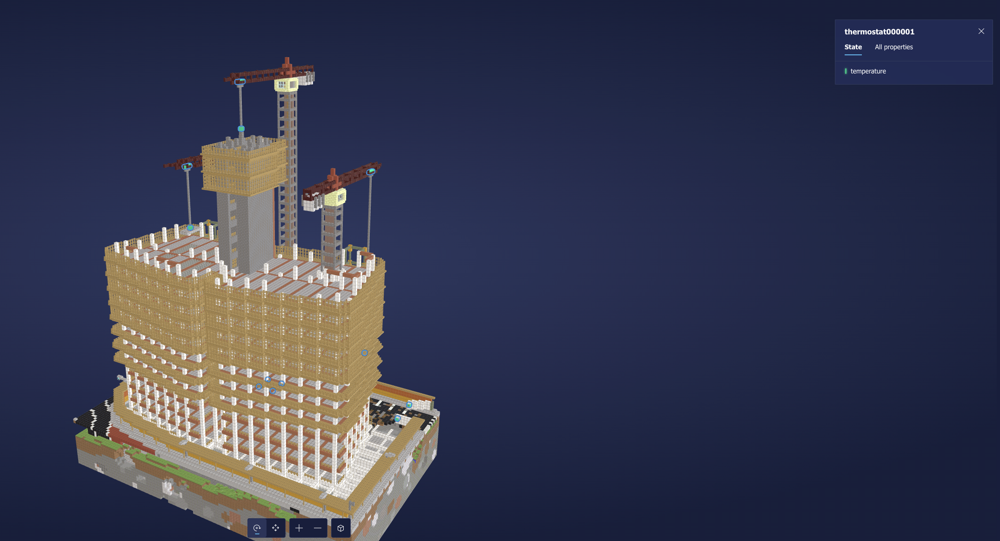

# Ingesting IoT Hub telemetry into Azure Digital Twins via Azure Functions

### Publish to Azure Function with
func azure functionapp publish IoTCocoFunction 

### Configuring Fuction App
az functionapp identity assign --resource-group <your-resource-group> --name <your-function-app-name>

az dt role-assignment create --dt-name <your-Azure-Digital-Twins-instance> --assignee "<principal-ID>" --role "Azure Digital Twins Data Owner"

//get host name with
az dt show --dt-name <your-Azure-Digital-Twins-instance>

az functionapp config appsettings set --resource-group ResourceCoco --name IoTCocoFunction --settings "ADT_SERVICE_URL=https://<your-Azure-Digital-Twins-instance-host-name>"

### Digital Twin Model
az dt model create --dt-name <instance-hostname-or-name> --models '{  "@id": "dtmi:contosocom:DigitalTwins:Thermostat;1",  "@type": "Interface",  "@context": "dtmi:dtdl:context;2",  "contents": [    {      "@type": "Property",      "name": "Temperature",      "schema": "double"    }  ]}'

az dt twin create  --dt-name <instance-hostname-or-name> --dtmi "dtmi:contosocom:DigitalTwins:Thermostat;1" --twin-id thermostat67 --properties '{"Temperature": 0.0}'

### Digital Twin Explorer 3D Model
Downlaod a free .glb file to integrate Twin IoT simulation in a visualisation 
(e.g. https://sketchfab.com/3d-models/under-construction-skyscraper-mineopolis-0bdaa04334b2470690f61da73431bdd2)

### Resources
https://learn.microsoft.com/en-us/azure/digital-twins/how-to-ingest-iot-hub-data
https://learn.microsoft.com/en-us/azure/digital-twins/quickstart-3d-scenes-studio 

### Dependencies
dotnet add package Azure.DigitalTwins.Core
dotnet add package Azure.Identity
dotnet add package Microsoft.Azure.WebJobs.Extensions.EventGrid
dotnet add package System.Net.Http  
dotnet add package Azure.Core  

*Azure Functions Core Tools*
brew tap azure/functions
brew install azure-functions-core-tools@4
# if upgrading on a machine that has 2.x or 3.x installed:
brew link --overwrite azure-functions-core-tools@4
